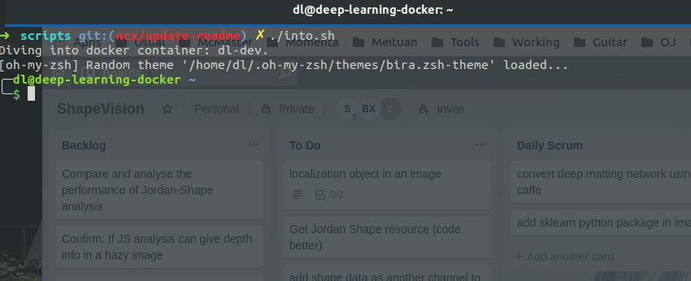
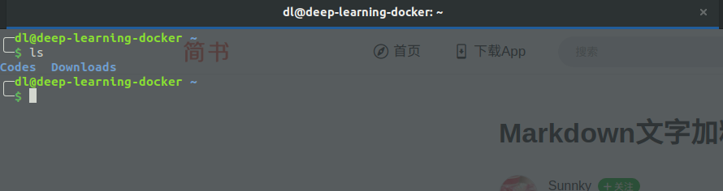

## dl-dev (deep learning development)
This docker image support a bunch of deep learning platform and easy to development. The developer is easy to debug and get around with all the dependencies within the container.

Support deep-learning platform list:

| Platform Name | Version | Language |
|---------------| :------:| --------:|
| Caffe    | 1.0.0   | C++, Python |
| Tensorflow | 1.12.0 | Python |

### Prerequesties
* GNU/Linux x86_64 with kernel version > 3.10
* Docker >= 1.12
* NVIDIA GPU with Architecture > Fermi (2.1)
* [NVIDIA](https://www.nvidia.com/object/unix.html) drivers ~= 361.93 (untested on older versions)

### Get started(setup)
* First, you should download docker yourself :). Check the following infomation:
    * For [Mac](https://docs.docker.com/docker-for-mac/install/#what-to-know-before-you-install).
    * For [Ubuntu](https://docs.docker.com/install/linux/docker-ce/ubuntu/).
    * For [Windows](https://docs.docker.com/docker-for-windows/install/#install-docker-for-windows-desktop-app).
    
    However, I highly recommend you use unix-like system since docker is well-supported on such OS.
* After successfully installed docker, run command `sudo usermod -aG docker ${USER}` to add your self into user-group within system wide.
* Reboot by invoking command `sudo reboot`.
* Change directory into `cd $DIR-TO-DL-DEV`.
* Install nvidia-docker for GPU usage, run command `./scripts/setup_nvidia_docker.sh`.

### How to use docker container and the dl-dev image
You can learn some basic docker information at docker's website [here](https://docs.docker.com/get-started/). I recommend you exercise the tutorial around.
* To start a container named dl-dev, you can do it by running run the command `./scripts/start.sh`. ***Note: this process is only needed if you have not start that container on the host before.*** It is only needed if you reboot your computer.
* Everytime you want to dive into the container and start programming, just run `./scripts/into.sh`. It should looks like this:
  
  

### About the docker container
* Within the docker container(dl-dev for this specific project), you are login as user "dl" and the *passwd is already set to "abcd"*.
* The directory of the workspace looks like this:

    
* The 'Downloads' directory is mount to your host machine's Downloads directory, so you can store your data outside docker.
* The 'Codes' directory is designed to store your code and project, this directory is invisible outside docker.
* `zsh`: Use oh-my-zsh theme for shell, and support zsh functionalities. Kindly check this [websit](https://www.jianshu.com/p/d194d29e488c?open_source=weibo_search).
* `VS Code`： You can issue `code` in zsh, then the container will open IDE in host machine.
* `tmux`: The configuration of tmux is as default, you can check useful information in this [page](http://louiszhai.github.io/2017/09/30/tmux/).

### To build the docker image
To build customized docker iamge yourself, please check [build reference](dockerfile/README.md). I do not recommand do this process unless you really need it. 

### Issues
Please contact `niuc@mcmaster.ca` for any issue. To add support, please also email me.

